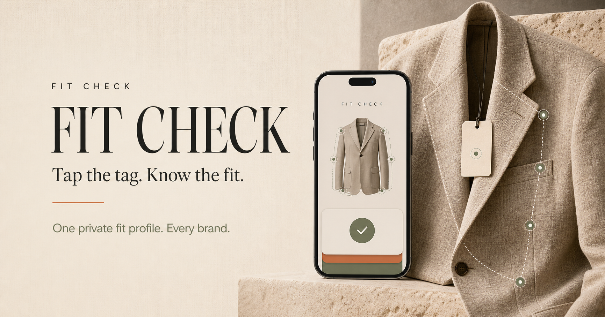

# Fit Check

**Tap the tag. Know the fit.**

Fit Check is a mobile-first product prototype for private clothing-fit prediction. It turns a device-held body profile, garment specifications, and anonymous signals from people with similar proportions into a clear fit recommendation—without exposing anyone’s measurements.

[Open the live prototype](https://fit-check-private-fit.sanjanavnkt20.chatgpt.site)



## The idea

Clothing sizes are inconsistent across brands, and reviews such as “I’m a medium and it fit perfectly” are rarely useful without knowing whether the reviewer is built like you.

Fit Check explores a more trustworthy interaction:

1. Create a private fit profile on your device.
2. Tap or scan a garment tag.
3. Compare garment proportions with your preferences.
4. Add anonymous fit evidence from people with similar proportions.
5. Return the verdict—not the underlying body data.

The current prototype uses realistic mocked data. It does not claim to implement production body scanning, NFC, private-set matching, or cryptographic infrastructure.

## Prototype highlights

- Simulated private body scan
- Press-and-hold NFC garment interaction
- Animated garment reading and fit mapping
- Size comparison across S, M, and L
- Anonymous “people built like you” fit signal
- Saved closet with local persistence
- Responsive mobile layout centered around a 390 × 844 viewport
- Original garment visual generated with Higgsfield

## Built with

- React 19
- TypeScript
- Tailwind CSS
- Framer Motion
- Lucide icons
- vinext / Cloudflare Workers

## Run locally

```bash
npm install
npm run dev
```

Then open `http://localhost:3000`.

## Validate

```bash
npm run build
```

## Prototype boundaries

Fit Check intentionally does not include authentication, a real camera scan, real NFC, checkout, payments, or backend infrastructure. Body profiles, garments, similarity cohorts, and fit results are mocked for product exploration.
